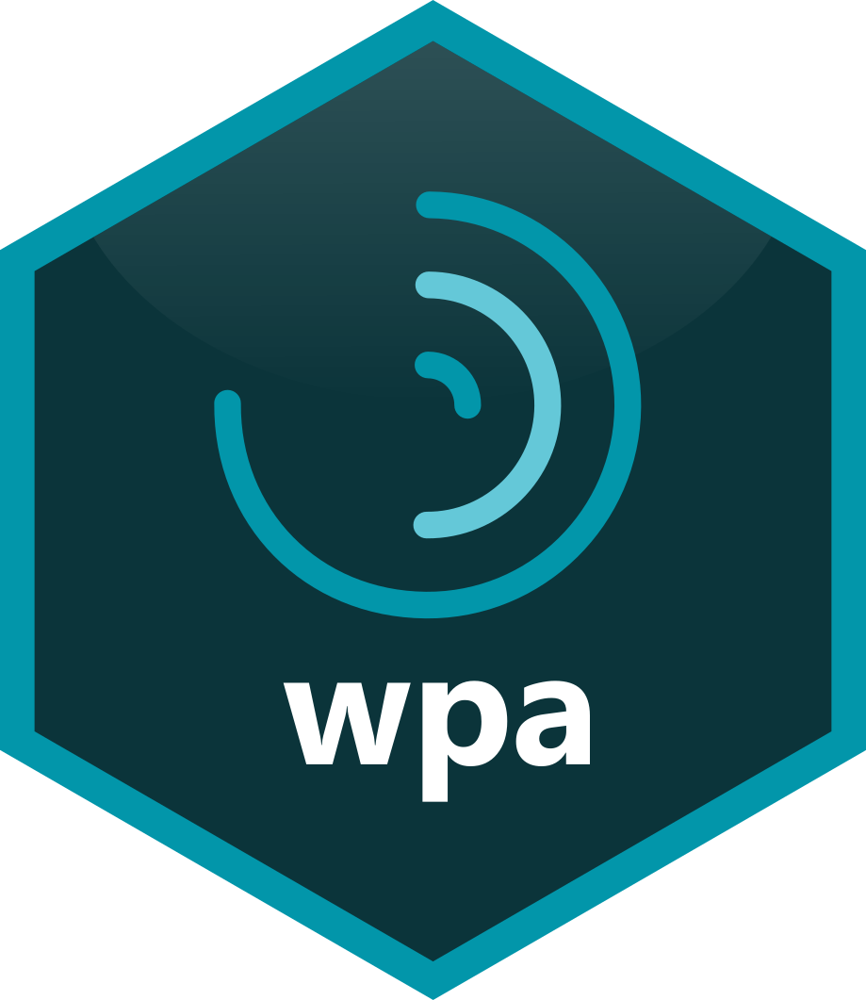
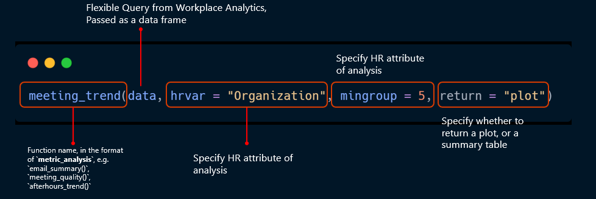
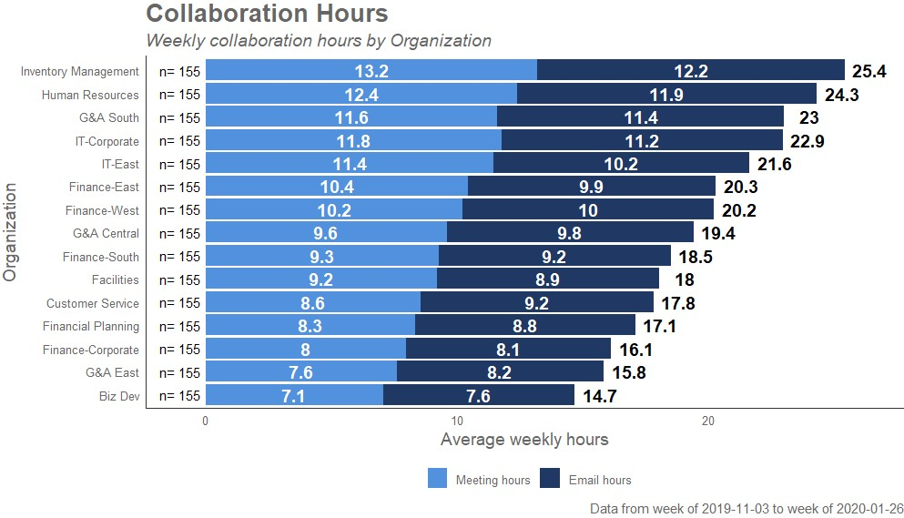

# wpa 

  [](https://github.com/microsoft/wpa/actions) [](https://www.codefactor.io/repository/github/microsoft/wpa) [](https://opensource.org/licenses/MIT) [](https://www.tidyverse.org/lifecycle/#maturing)

## Analyze and Visualize Workplace Analytics data

This is an R package for analyzing and visualizing data from [Microsoft Workplace Analytics](https://www.microsoft.com/microsoft-365/partners/workplaceanalytics).

## With the **wpa** package, you can...

1. **Run prebuilt analysis and visualizations** off Workplace Analytics data with settings for HR variables, privacy threshold, etc.
2. **Generate prebuilt interactive HTML reports**, which cover specific areas e.g. collaboration, connectivity 
3. Leverage **advanced analytics functions**, such as text mining and hierarchical clustering, which are built for Workplace Analytics metrics
4. Integrate analysis of Workplace Analytics data with your R workflow seamlessly

Here are just some examples of the plots that you can create with **wpa**:


## Design Principles

- **Simple**: the functions ought to be simple and intuitive to maximise adoption.
- **Practical**: the functions should prioritise delivering against the most frequently used outputs and analyses.
- **Consistency**: functions should share a broadly consistent set of input arguments and naming conventions. This will help minimise unexpected results and errors when using the package. 
- **Parsimony**: in creating the package, as much of the existing code should be re-used if possible to minimise duplication of work and to make analysis reproducible.
- **Tidy**: the functions from the package are designed to be consistent with tidy principles, and work well with a **dplyr** pipe (`%>%`) workflow.



---

## :rocket: Quick start guide - For users

### Installing the package

You can install the GitHub version of **wpa** with the following in R: 
```R
# Check if devtools is installed, if not then install it
if(!"devtools" %in% installed.packages()){
  install.packages("devtools")
}
devtools::install_git(url = "https://github.com/microsoft/wpa.git")
```
Note that **wpa** is not yet released on CRAN, and therefore `install.packages()` will not work.

### Examples

The package comes shipped with a sample Standard Query dataset (`sq_data`), so you can start exploring functions without having to read in any data. Most functions in **wpa** share a consistent API, and enable you to return results for both a **plot** or a **table** (data frame):

```R
collaboration_sum(sq_data, return = "plot")
```


By passing 'table' to the `return` argument, the function will return a data frame with the relevant summary statistics. 

---

## :package: Package Structure

For information on the package structure, please see [here](.github/analyst_guide.md).

Also check out our package cheat sheet for more information:

<a href="man/figures/wpa cheatsheet_20201116.pdf"></a>

---

## Vignette

You can browse the vignette by running the following in R:
```R
vignette(topic = "intro-to-wpa", package = "wpa")
```

---

## :hammer: Developers

We welcome contributions to the package! 

### Contributing code
If you would like contribute code to the repo, please read our [Contributor Guide](CONTRIBUTING.md) and [Developer Guide](.github/developer_guide.md). This documentation should provide you all the information you will need to get started.

### Issues or Feature Requests
If you would like to log an issue or submit a feature request, please create a new issue or comment on an existing issue on [GitHub Issues](https://github.com/microsoft/wpa/issues) on this repo.

### Reporting Security Issues
Please do not report security vulnerabilities through public GitHub issues. Please read our Security document [for more details](.github/reporting_security_issues.md).

### Changelog
See [NEWS.md](NEWS.md) for the package changelog.

---

## Code of Conduct

We would ask you to please read the [Microsoft Open Source Code of Conduct](https://opensource.microsoft.com/codeofconduct) prior to engaging with this package.


**Trademarks** 

This project may contain trademarks or logos for projects, products, or services. Authorized use of Microsoft trademarks or logos is subject to and must follow [Microsoft's Trademark & Brand Guidelines](https://www.microsoft.com/en-us/legal/intellectualproperty/trademarks/usage/general). Use of Microsoft trademarks or logos in modified versions of this project must not cause confusion or imply Microsoft sponsorship. Any use of third-party trademarks or logos are subject to those third-party's policies.
